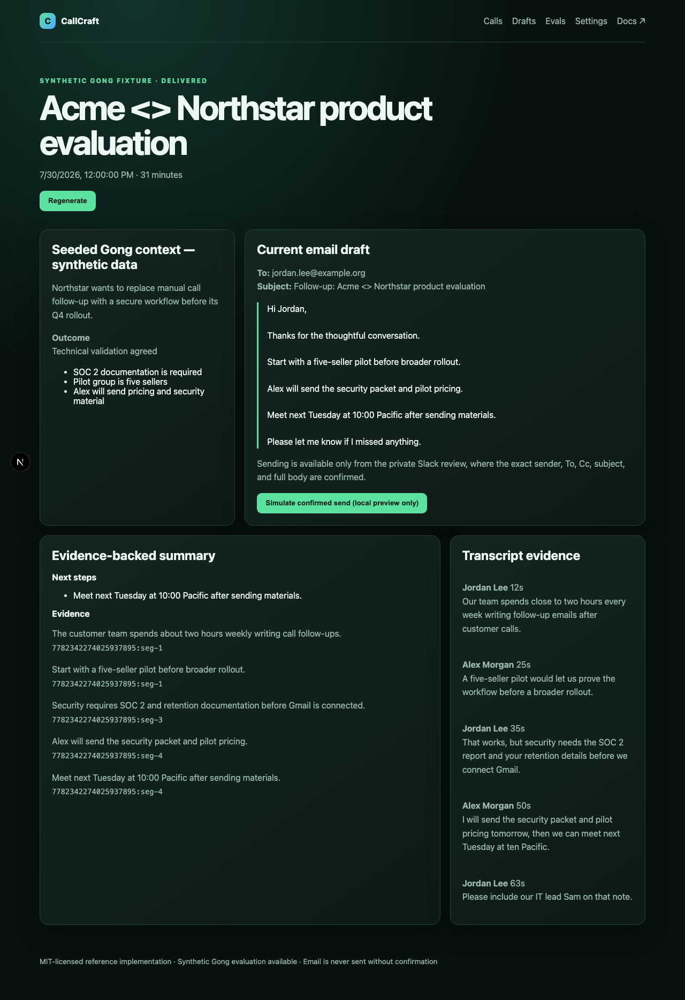

# CallCraft

CallCraft is an MIT-licensed, production-minded reference implementation and live Applied AI demo for individual sellers. It watches completed Gong-shaped calls, waits for the transcript, extracts an evidence-backed summary through OpenRouter, composes a follow-up, and sends it privately to Slack. The seller can inspect Gong context and transcript evidence, edit/regenerate, then explicitly confirm a Gmail send. Email is **never sent automatically**.

[](https://github.com/mherzog4/callcraft/actions/workflows/ci.yml)
[](https://callcraft-oss.vercel.app)




Every claim in the summary above carries the transcript segment ID it came from, and the draft is rendered from those claims by deterministic templates rather than free-form model prose. The screenshot is the seeded demo — synthetic transcript, reserved example-domain recipient, no provider contacted.

## Demo in five minutes (no Docker)

Requirements: Node 20+ and npm 10+ on macOS or Linux, or Windows via WSL. `better-sqlite3` and `sqlite-vec` are native modules; a clean machine needs a C/C++ toolchain if no prebuilt binary matches. Verified on macOS and on Ubuntu with Node 22 in CI.

```bash
cp .env.example .env
npm install
npm run db:migrate
npm run db:seed
# terminal 1: durable polling/generation/delivery worker
npm run worker -- --watch
# terminal 2
npm run dev
```

Open <http://localhost:3000>. Demo mode uses Gong-shaped synthetic fixtures, deterministic grounded generation, a local Slack preview, and a local RFC 5322 email preview. Nothing contacts Gong, Slack, Google, or OpenRouter, and all real OAuth entry points are disabled. Inspect `data/previews/`; the call screen can simulate the Slack-confirmed send into the local preview only. Reset with `npm run demo:reset`.

The web process only authenticates, renders state, and enqueues work. **Sync & process now** enqueues a discovery job; the worker performs all provider calls. In watch mode it schedules Gong polling every five minutes, daily cleanup, lease recovery, and bounded transcript retries.

## Architecture

```text
Gong poller -> SQLite job queue -> call/context/transcript
  -> OpenRouter extraction (evidence IDs) -> composition
  -> Slack DM/App Home -> seller edit/regenerate/confirm
  -> Gmail API submission -> Slack status update
```

See the [documentation index](docs/README.md), [architecture guide](docs/ARCHITECTURE.md), and [architecture decision records](docs/adr/README.md) for state machines, trust boundaries, and the trade-offs behind the system. Adapters are defined for transcript source, generation, draft destination, and email sender. Demo and real implementations use the same normalized contracts; real failures never fall back to demo data.

## End-to-end evaluation without Gong

To test real OpenRouter, Slack, and Gmail without a Gong account, use `APP_MODE=evaluation`. CallCraft attaches the existing synthetic Gong fixtures to the seller created by Slack OAuth while keeping every downstream provider real. Follow the complete [local Cloudflare Tunnel evaluation runbook](docs/EVALUATION.md). The seeded recipient uses a reserved example domain, so Send remains blocked until you use Slack **Edit** to replace To/Cc with evaluator-owned addresses.

The runtime policy is intentionally strict: `demo` permits only local/seeded adapters, `evaluation` permits only seeded Gong plus real OpenRouter/Slack/Gmail, and `production` permits only real adapters. Provider failures never trigger fallback.

The maintainer does not have a Gong tenant, so the real Gong connector is implemented and contract-tested but not represented as live-tenant verified. The seeded adapter exercises the same ingestion and normalized SQLite boundary used downstream.

## Applied AI evals

Run the credential-free golden baseline and open `/evals`:

```bash
npm run eval
```

For opt-in OpenRouter model comparison:

```bash
npm run eval:live -- --models google/gemini-2.5-flash openai/gpt-4.1-mini
```

The versioned synthetic dataset measures citation validity, evidence and concept recall, recipient accuracy, unsupported content, draft grounding, latency, tokens, repair attempts, and OpenRouter-reported cost. An optional `npm run eval:retrieval` experiment uses OpenRouter embeddings with `sqlite-vec`, but vector retrieval does not alter the safer full-transcript default. See [Applied AI evals](docs/EVALS.md).

## Real provider setup

### Gong

A Gong technical administrator creates an Access Key/Secret and supplies the tenant-specific API base URL. Set `APP_MODE=production`, authenticate the seller through Slack, then enter the Gong base URL and credentials in Settings. CallCraft fetches `GET /v2/users` server-side so the seller can select the correct active Gong identity; changing that selection later does not require re-entering secrets. Provider secrets are AES-256-GCM encrypted per installation; environment Gong/OpenRouter values remain optional operator fallbacks. The connector uses:

- `GET /v2/users`
- `GET /v2/calls`
- `POST /v2/calls/extensive` for parties, brief, outline, highlights, outcome, and key points
- `POST /v2/calls/transcript`

It follows cursors, ignores additive fields, records Gong request IDs, throttles to the default 3 requests/second, honors `Retry-After`, and overlaps sync windows safely. Select/map the seller's Gong user in setup. Basic auth is implemented first; the adapter leaves room for Gong OAuth.

### OpenRouter

Enter an OpenRouter API key and supported model in Settings (or provide the documented environment fallback). The model must reliably return JSON. Extraction and composition outputs are Zod validated with one repair attempt. Transcript and Gong content are treated as untrusted quoted data; every material extracted claim must have an exact evidence entry mapped to valid, non-empty transcript segment IDs. For composition, the model selects exact evidence-backed claims rather than producing free-form prose; the app renders those claims with deterministic templates and rejects unsupported dates, prices, percentages, times, links, and recipients. The model can be changed later without re-entering the API key.

### Slack app

Create a Slack app using [docs/slack-manifest.yaml](docs/slack-manifest.yaml), enable App Home messages/interactivity, and set:

- OAuth redirect: `${APP_URL}/api/slack/oauth/callback`
- Interactivity URL: `${APP_URL}/api/slack/interactions`
- `SLACK_CLIENT_ID`, `SLACK_CLIENT_SECRET`, `SLACK_SIGNING_SECRET`

Install through Settings. Slack OAuth either bootstraps the seller from `users.info` or is cryptographically bound to the initiating signed seller session. OAuth state is signed and short-lived; bot tokens are AES-256-GCM encrypted. Slack signatures, actor team/user ownership, and five-minute replay windows are verified. Regenerate actions are replay-idempotent. Actions are Edit, Regenerate, View context/evidence, Open in Gong, and Send email. Existing messages are updated rather than duplicated. Interaction requests acknowledge before deferred Slack API calls so modal opens do not consume Slack's three-second acknowledgement window.

### Google OAuth and Gmail

Create a Google Cloud OAuth web client, enable Gmail API, and register `${APP_URL}/api/google/oauth/callback`. Set `GOOGLE_CLIENT_ID` and `GOOGLE_CLIENT_SECRET`. CallCraft requests identity scopes and only `https://www.googleapis.com/auth/gmail.send`; refresh tokens are encrypted. Gmail messages are standards-compliant MIME submitted with `users.messages.send` and appear in Sent.

Public deployments using Gmail scopes generally need Google OAuth consent-screen verification. Keep the app in Testing with explicit test users for local evaluation. Self-hosters must use their own OAuth client. Google OAuth is bound to the initiating signed seller session. A Slack send action requires a connected Gmail account and opens an exact-revision confirmation modal that displays From, To, Cc, subject, and the complete body; double submissions are idempotent. Each MIME message carries a deterministic intent Message-ID/header. Gmail acceptance is reported as **Submitted**, never “delivered” or “read.” A worker crash or network timeout after submission moves the intent to **unknown**, disables automatic retry/send, and requires manual Gmail reconciliation. A definite authorization failure marks Gmail as **reconnect required**, updates Slack with an explicit not-sent status, and offers reconnection from Settings.

## Configuration and privacy

Copy `.env.example`. Select exactly one `APP_MODE`: `demo`, `evaluation`, or `production`. The legacy `DEMO_MODE` variable is accepted only when `APP_MODE` is absent and should be removed when migrating. Production and evaluation require strong random `MASTER_KEY` and `SESSION_SECRET`; rotating the master key requires re-encrypting credentials or reconnecting providers. Raw transcript retention defaults to seven days and can be set to a bounded day count or **after Slack delivery**. The latter removes raw segments on the next cleanup run immediately after a call reaches `delivered`, without applying the day cutoff. Cleanup retains minimal call, revision, and send-audit metadata. SQLite backups may retain deleted pages; use encrypted volumes, a suitable backup expiry, and SQLite `VACUUM` policies where hard deletion is required.

Logs are structured and redact tokens, secrets, email/recipient values, transcripts, Gong context, and email bodies. The database still contains sensitive working data: secure the host and volume, use TLS at the reverse proxy, and restrict operator access. Do not send customer data to models without organizational approval and applicable consent.

## SQLite limits and PostgreSQL path

SQLite uses WAL, foreign keys, a 5-second busy timeout, short transactions, unique external IDs/idempotency keys, and transactional job claims. It is appropriate for local use and a single host. Do not place the DB on an unsafe network filesystem or scale the web/worker across hosts. For multi-instance/serverless use, replace the Drizzle SQLite schema/repositories and queue claim with PostgreSQL (`FOR UPDATE SKIP LOCKED`) or a managed queue; provider and workflow business logic remains unchanged.

## Commands

```bash
npm run format:check
npm run lint
npm run typecheck
npm run eval
npm run eval:live -- --models google/gemini-2.5-flash
npm run eval:retrieval
npm run evaluation:doctor
npm run acceptance:verify
npm test
npx playwright install chromium && npm run test:e2e
npm run build
npm run check
```

Default CI mocks all providers and runs the deterministic no-network eval baseline. Live OpenRouter evals, embeddings, Slack/Gmail acceptance, and real-provider smoke tests are opt-in and secret-gated.

## Marketing site

The public site at [callcraft-oss.vercel.app](https://callcraft-oss.vercel.app) is a dependency-free static project in [`marketing/`](marketing/README.md). It deploys separately from the operational application so Vercel never serves routes that require the persistent SQLite volume or worker process.

## Hosted evaluation demo

[Deploy one Railway service](docs/RAILWAY.md) with one replica and a persistent volume mounted at `/data`. The checked-in Railway configuration builds the Dockerfile, migrates SQLite at runtime, supervises the web process and durable worker together, and checks `/api/health`. A hosted service removes the need for a local Cloudflare Tunnel.

## Optional Docker Compose

```bash
cp .env.example .env
# Replace production secrets; keep APP_MODE=demo for the safe walkthrough.
docker compose up --build
```

The web and worker share one persistent SQLite volume on one host. Docker is optional.

## Contributing and security

See [CONTRIBUTING.md](CONTRIBUTING.md) and [SECURITY.md](SECURITY.md). Synthetic fixtures only—never commit customer transcripts or provider credentials. Licensed under [MIT](LICENSE).
